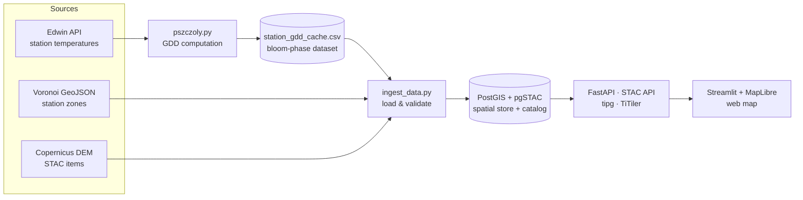

# bee_project

A geospatial data platform that combines meteorological and remote-sensing data
to support **mobile beekeeping** — helping decide where and when to place beehives
based on the flowering of melliferous (honey) plants.

The application ingests heterogeneous geospatial and weather data, runs it through
an ETL pipeline, stores it in a spatial database with a STAC metadata catalog, and
serves it through REST / OGC APIs to an interactive web map.

> **Status:** early development. Core pipeline, APIs and map are working; data
> coverage and additional plant species are still being expanded.

---

## Table of contents

- [Overview](#overview)
- [Data pipeline & lineage](#data-pipeline--lineage)
- [Architecture](#architecture)
- [Tech stack](#tech-stack)
- [Project structure](#project-structure)
- [Quick start](#quick-start)
- [Data sources](#data-sources)
- [API endpoints](#api-endpoints)
- [Roadmap](#roadmap)

---

## Overview

A mobile beekeeper moves hives between apiaries depending on which honey plants are
in bloom. This platform supports that decision by combining three data layers:

- **Weather-station influence zones** — Voronoi cells around meteorological stations.
- **Bloom phase** — flowering stage of goat willow (*Salix caprea*), derived from
  Growing Degree Days (GDD) accumulated from January 1st.
- **Terrain** — Copernicus DEM (30 m) served as a raster layer.

The current implementation covers the Lubelskie region (Poland), but the pipeline
is data-driven: swapping the input datasets retargets it to any area or plant.

---

## Data pipeline & lineage

Every value shown on the map can be traced back to its source through an explicit
chain of transformations — raw weather observations become station temperatures,
which become GDD values, which become a bloom phase. Each step is a discrete,
reproducible operation with versioned inputs and outputs.



| Stage | Role | Artifact |
| --- | --- | --- |
| **Source** | Origin data | Edwin weather API, Voronoi GeoJSON, Copernicus DEM |
| **Operation** | Transformation | `pszczoly.py` (GDD), `ingest_data.py` (load) |
| **Dataset** | Derived data | `station_temperatures.csv`, `station_gdd_cache.csv` |
| **Store** | Persistence + metadata | PostGIS (vector), pgSTAC (STAC catalog) |
| **Serve** | Access layer | FastAPI, STAC API, tipg (MVT), TiTiler (COG) |
| **Consume** | Presentation | Streamlit + MapLibre map |

The STAC catalog (SpatioTemporal Asset Catalog, OGC STAC 1.0) acts as the
**metadata layer**: it describes each raster asset — extent, time, links — so the
serving and presentation layers can discover data without hard-coded paths.

---

## Architecture

```
Browser
   |
   +-- MapLibre JS (MVT tiles) --> tipg     :8083 --> PostGIS
   +-- MapLibre JS (XYZ tiles) --> TiTiler  :8082 --> COG (URL)
   |
Streamlit :8502
   |
   +-- httpx --> FastAPI  :8000 --> PostGIS
   +-- httpx --> STAC API :8088 --> PostGIS (pgSTAC)
```

---

## Tech stack

| Technology | Role |
| --- | --- |
| **FastAPI** | Backend REST API |
| **PostGIS** | Spatial database (vector data) |
| **pgSTAC** | PostgreSQL extension for the STAC catalog |
| **stac-fastapi** | STAC API server (OGC STAC 1.0) |
| **TiTiler** | Raster tile serving from Cloud Optimized GeoTIFF (COG) |
| **tipg** | Vector (MVT) tile serving directly from PostGIS |
| **Streamlit** | Web UI with a MapLibre GL map |
| **Docker + uv** | Containerization and Python environment management |

---

## Project structure

```
bee_project/
|
|- docker-compose.yml          # Service definitions
|- .env.example                # Example environment variables
|- Makefile                    # Common command shortcuts
|
|- data/                       # Input & derived datasets
|   |- lubelskie_edwin_voronoi.geojson   # Station Voronoi zones -> PostGIS
|   |- honey_plants.json                 # Melliferous-plant dictionary
|   |- station_temperatures.csv          # Output of pszczoly.py -> PostGIS
|   |- station_gdd_cache.csv             # Output of pszczoly.py -> PostGIS
|   |- stac_collection.json              # STAC collection definition
|   +- stac_items.json                   # STAC items (links to COGs)
|
|- info_pszczoly/              # Source data acquisition & processing
|   |- pobieranie.py                     # Fetch data from the Edwin API
|   |- pszczoly.py                       # GDD processing -> data/
|   +- historia_meteo_2024_2025.csv      # Raw daily station temperatures
|
|- scripts/                    # One-off data loading (db-init)
|   |- ingest_data.py                    # Main ingestion script
|   |- Dockerfile
|   +- pyproject.toml
|
|- backend/                    # FastAPI service
|   |- src/app/
|   |   |- main.py                       # App configuration
|   |   |- config.py                     # Env settings (pydantic-settings)
|   |   |- database.py                   # Database class (asyncpg)
|   |   |- models.py                     # Pydantic data models
|   |   |- dependencies.py               # Dependency injection (get_db)
|   |   +- routers/
|   |       |- health.py                 # GET /health
|   |       |- cells.py                  # Weather-station zones, ST_Contains
|   |       +- blooming.py               # Bloom-phase endpoint
|   |- Dockerfile
|   +- pyproject.toml
|
|- frontend/                   # Streamlit UI
|   |- src/
|   |   |- app.py                        # Main Streamlit app
|   |   +- config.py                     # Service addresses
|   |- Dockerfile
|   +- pyproject.toml
|
|- stac-api/                   # stac-fastapi-pgstac
|   |- main.py
|   |- Dockerfile
|   +- pyproject.toml
|
+- tipg/                       # Vector tile server
    |- Dockerfile
    +- pyproject.toml
```

---

## Quick start

```bash
# 1. Clone the repository
git clone https://github.com/Kacpeee/bee_project.git
cd bee_project

# 2. Copy the configuration file
cp .env.example .env

# 3. Build and start the services
make build
make up

# 4. Wait ~30 seconds, then check status
make ps
```

Once running, the services are available at:

| Service | URL |
| --- | --- |
| Streamlit (web map) | http://localhost:8502 |
| FastAPI (Swagger UI) | http://localhost:8000/docs |
| STAC API | http://localhost:8088 |
| TiTiler | http://localhost:8082/docs |
| tipg | http://localhost:8083 |

> On the first run, the `db-init` service loads sample data and then exits
> automatically (status `Exited 0`).

**Available `make` commands**

```bash
make up        # Start services in the background
make down      # Stop services
make build     # Build Docker images
make logs      # Follow logs (Ctrl+C to exit)
make ps        # Service status
make reset     # Stop and remove data (volumes) — WARNING: drops the database
make shell-db  # Open a psql shell
```

---

## Data sources

| File | Description |
| --- | --- |
| `data/lubelskie_edwin_voronoi.geojson` | 42 zones around weather stations (polygons) |
| `data/honey_plants.json` | Melliferous-plant dictionary (currently goat willow) |
| `info_pszczoly/historia_meteo_2024_2025.csv` | Raw daily station temperatures (2024–2025) |
| `info_pszczoly/pobieranie.py` | Fetches data from the Edwin API |
| `info_pszczoly/pszczoly.py` | GDD processing → outputs in `data/` |
| `data/station_temperatures.csv` | GDD pipeline output → PostGIS |
| `data/station_gdd_cache.csv` | GDD pipeline output → PostGIS |
| `data/stac_collection.json` | STAC collection: `lubelskie-dem` |
| `data/stac_items.json` | Copernicus DEM GLO-30 tiles (N50/N51, E021–E023) |

Temperature source: the Edwin API (responses cached locally as CSV).

**Reloading data after changes**

```bash
# 0. (optional) fetch fresh data from the Edwin API — edit the date range first
python info_pszczoly/pobieranie.py

# 1. Process temperatures and GDD locally (requires pandas)
python info_pszczoly/pszczoly.py

# 2. Load the generated files into PostGIS
docker compose run --rm db-init
```

---

## API endpoints

```
GET /cells/stations                 # List weather stations
GET /cells/at-point?lon=&lat=       # Find the zone containing a point (ST_Contains)
GET /blooming/?station_id=&date=&plant_id=salix_caprea   # Bloom phase
```

The STAC API additionally exposes the standard catalog endpoints
(`/collections`, `/collections/{id}/items`, `POST /search`).

---

## Roadmap

- Add more melliferous plants (rapeseed, buckwheat, phacelia).
- Backfill temperatures for the 14 remaining stations via the Edwin API.
- Colour the map by bloom phase for a selected date.
